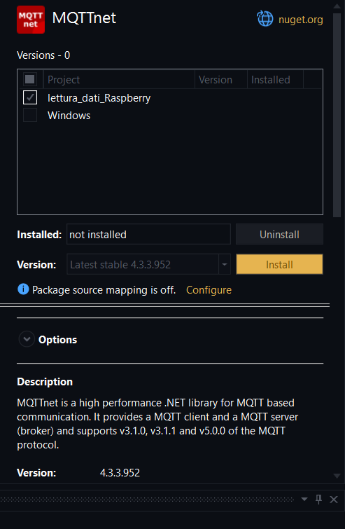

# visualizza i dati della RAM, ROM totale Libera e usata e CPU dI Raspberry
immaginestagionest
prima parte di configurazione degli using

- Management 


intanto parte di configurazione degli using e namespace


```C#
using System;
namespace lettura_dati_Raspberry;
```

Leggi le informazioni sulla RAM, ROM e CPU dal PC locale e stampa in automatico anche l'stanza della clsee Data

```C#
class Program
{
    static void Main(string[] args)
    {
        // instanzio oggetto della classe Data
        Data data = new Data();

        // Stampare informazioni sulla RAM, ROM e CPU
        Console.WriteLine("Informazioni sulla RAM:");
        Console.WriteLine(data.GetRamInfo());

        Console.WriteLine("\nInformazioni sulla ROM:");
        Console.WriteLine(data.GetRomInfo());

        Console.WriteLine("\nInformazioni sulla CPU:");
        Console.WriteLine(data.GetCpuInfo());
    }
}
```

implementazione Classe Data con gli using e namespace

```C#
using System.Diagnostics;
using System.Globalizzazion;
namespace lettura_dati_Raspberry;
```

crea la classe Data

```C#
class Data
{
    // vari metodi
}
```

dentro la classe Data creo i vari metodi

- ottieni RAM

```C#
public string GetRamInfo()
{
    try
    {
        var processStartInfo = new ProcessStartInfo
        {
            FileName = "free",
            RedirectStandardOutput = true,
            UseShellExecute = false,
            CreateNoWindow = true
        };

        using (var process = Process.Start(processStartInfo))
        {
            using (var reader = process.StandardOutput)
            {
                string output = reader.ReadToEnd();
                string[] lines = output.Split('\n');

                if (lines.Length >= 2)
                {
                    string[] values = lines[1].Split(new[] { ' ' }, StringSplitOptions.RemoveEmptyEntries);

                    if (values.Length >= 4)
                    {
                        ulong totalRam = ulong.Parse(values[1]);
                        ulong usedRam = ulong.Parse(values[2]);
                        ulong freeRam = ulong.Parse(values[3]);

                        // Converti almeno uno dei valori in double per ottenere risultati decimali
                        double usedRamPercentage = (double)usedRam / totalRam * 100;
                        double freeRamPercentage = (double)freeRam / totalRam * 100;

                        return $"RAM Used: {usedRamPercentage:F2}%, RAM Free: {freeRamPercentage:F2}%, RAM Total: {totalRam} MB";
                    }
                }
            }
        }

        return "Failed to retrieve RAM information";
    }
    catch (Exception ex)
    {
        return $"Error: {ex.Message}";
    }
}
```

- Ottieni ROM

```C#
public string GetRomInfo()
{
    try
    {
        var processStartInfo = new ProcessStartInfo
        {
            FileName = "df",
            Arguments = "-h /",
            RedirectStandardOutput = true,
            UseShellExecute = false,
            CreateNoWindow = true
        };

        using (var process = Process.Start(processStartInfo))
        {
            using (var reader = process.StandardOutput)
            {
                string output = reader.ReadToEnd();
                string[] lines = output.Split('\n');

                if (lines.Length >= 2)
                {
                    string[] values = lines[1].Split(new[] { ' ' }, StringSplitOptions.RemoveEmptyEntries);

                    if (values.Length >= 6)
                    {
                        string totalRomStr = values[1].TrimEnd('G');
                        string usedRomStr = values[2].TrimEnd('G');
                        string freeRomStr = values[3].TrimEnd('G');

                        double totalRom = double.Parse(totalRomStr, CultureInfo.InvariantCulture); // Convert GB to MB
                        double usedRom = double.Parse(usedRomStr, CultureInfo.InvariantCulture); // Convert GB to MB
                        double freeRom = double.Parse(freeRomStr, CultureInfo.InvariantCulture); // Convert GB to MB

                        return $"ROM Used: {(usedRom / totalRom) * 100} %, ROM Free: {(freeRom / totalRom) * 100} %, ROM Total: {totalRom / (1024 * 1024)} MB";
                    }
                }
            }
        }

        return "Failed to retrieve ROM information";
    }
    catch (Exception ex)
    {
        return $"Error: {ex.Message}";
    }
}
```

- Ottieni Info CPU

```C#
public string GetCpuInfo()
{
    try
    {
        var processStartInfo = new ProcessStartInfo
        {
            FileName = "cat",
            Arguments = "/proc/cpuinfo",
            RedirectStandardOutput = true,
            UseShellExecute = false,
            CreateNoWindow = true
        };

        using (var process = Process.Start(processStartInfo))
        {
            using (var reader = process.StandardOutput)
            {
                string output = reader.ReadToEnd();
                return $"CPU Info:\n{output}";
            }
        }
    }
    catch (Exception ex)
    {
        return $"Error: {ex.Message}";
    }
}
```

## ora lo si bilda sul Raspberry

### mi connetto via ssh

```bash
sshnome@inidrizzo_ip

sudo service ssh status #vedi se ssh è attivo
sudo service ssh start #attivi ssh
```

### Scarico dotnet passando via scp e lo scarico

```bash
sudo rm -r nomecartella #elimini cartella
rm nomefile #elimini file 
```
### Comprimi La cartella scaricando WinRar e lo passi via SCP al Raspberry con estensuibe .zip

```bash
scp C:\percorso\del\tuo\file.txt pi@192.168.1.2:/percorso/di/destinazione/ #sposti file
scp -r C:\percorso\del\tuo\file.txt pi@192.168.1.2:/percorso/di/destinazione/ #sposti carte
```

### Decompressione file .zip passato da Windows
```bash
sudo apt-get install unzip #scarico file per estensione .zip
unzip nome_file.zip #decomprime file
unzip nome_file.zip -d percorso/di/destinazione #sposto dove mi serve
```

### Scarico Dotnet
```bash
curl -sSL https://dot.net/v1/dotnet-install.sh | bash /dev/stdin --channel STS #scarico dotnet nel raspberry

echo 'export DOTNET_ROOT=$HOME/.dotnet' >> ~/.bashrc
echo 'export PATH=$PATH:$HOME/.dotnet' >> ~/.bashrc
source ~/.bashrc

dotnet --version

chmod +x nomefile #do opzione di esecuzione al file
dotnet run #esegue il codice dotnet
```

### Infine programma funzionate alla fine


# Dati con il Protocollo MQTT

## Implementami la funzionalità per usare MQTT nel Raspberry

aggiungi pacchetti per l'uso del Protocollo MQTTnet

```bash
dotnet add package MQTTnet
```

Nel progetto di Visual studio scarichi MQTTnet per poterci lavorare



Nel file csproj aggiungi questa configurazione
```bash
nano Lettura_dati_Raspberry.csproj #modifici file e aggiungi la riga che segue
```
```xml
 <ItemGroup> 
    <PackageReference Include="MQTTnet" Version="3.0.0" /><!-- qui includo il pacchetto MQTTnet con la versione 3.0.0 -->
</ItemGroup>
```

Infine il seguente comando per bildare il progetto
```bash
dotnet build #bilda il progetto
```

Creo una classe dove fare le implementazioni di cosa mandare via MQTT
```C#
internal class DataSend{
    // codice
}
```
Implementazione degli using e Namespace della classe DataSend

```C#
using System;
using System.Diagnostics;
using System.Globalization;
using System.Text;
using System.Threading.Tasks;
using MQTTnet;
using MQTTnet.Client;

namespace lettura_dati_Raspberry;
```

Aggiungere le variabile dove mettere le credenzili

```C#
private static IMqttClient _mqttClient;
private static string _brokerAddress = "indirizzo server";
private static int _brokerPort = 1883;
private static string _username = "nome utente";
private static string _password = "password";
private static string _clientId = "your-client-id";
private static MqttProtocolVersion _protocolVersion = MqttProtocolVersion.V311;
private static string _baseTopic = "base_topic"; // Replace with your desired base topic

// creo istanza dell'ogetto della classe Data
Data data = new Data();
```


### Creo le funzioni che mi servono
- per creare il client (GetMqttClient)
```C#
public static IMqttClient GetMqttClient()
{
    if (_mqttClient == null)
    {
        var factory = new MqttFactory();
        _mqttClient = factory.CreateMqttClient();
    }

    return _mqttClient;
}
```

- Per connetersi al Client (ConnectAsync)
```C#
public static async Task<bool> ConnectAsync()
{
    try
    {
        if (_mqttClient == null)
        {
            var factory = new MqttFactory();
            _mqttClient = factory.CreateMqttClient();
        }

        if (_mqttClient.IsConnected)
        {
            return true;
        }

        var options = new MqttClientOptionsBuilder()
            .WithTcpServer(_brokerAddress, _brokerPort)
            .WithCredentials(_username, _password)
            .WithClientId(_clientId)
            .WithProtocolVersion(_protocolVersion)
            .Build();

        await _mqttClient.ConnectAsync(options);
        return _mqttClient.IsConnected;
    }
    catch (Exception ex)
    {
        Console.WriteLine($"Error connecting MQTT client: {ex.Message}");
        return false;
    }
}
```

- Per disconnetsi dal Client (DisconnectAsync)
```C#
public static async Task DisconnectAsync()
{
    try
    {
        if (_mqttClient != null && _mqttClient.IsConnected)
        {
            await _mqttClient.DisconnectAsync();
        }
    }
    catch (Exception ex)
    {
        Console.WriteLine($"Error disconnecting MQTT client: {ex.Message}");
    }
}
```

- Metodo per pubblicare i dati (PublishMqttMessageAsync)
```C#
public static async Task PublishMqttMessageAsync(string topic, string payload)
{
    try
    {
        var mqttClient = GetMqttClient();

        // Connect using the shared MQTT client instance
        await ConnectAsync();

        var message = new MqttApplicationMessageBuilder()
            .WithTopic(topic)
            .WithPayload(payload)
            .Build();

        await mqttClient.PublishAsync(message);

        // Disconnect using the shared MQTT client instance
        await DisconnectAsync();
    }
    catch (Exception ex)
    {
        Console.WriteLine($"Error publishing MQTT message: {ex.Message}");
    }
}
```

- Stampa i dati da quel metodo che legge i dati con quel topic (GetFullTopic)
```C#
public static string GetFullTopic(string dataType)
{
    // Concatenate the base topic with the specific data type
    return $"{_baseTopic}/{dataType}";
}
```

- Stmpa info dei dati acquisiti (Get)
```C#
public string GetDataInfo(string datatype)
{
    var GetRaminfo = data.GetRamInfo();
    var GetRominfo = data.GetRomInfo();
    var GetCpuinfo = data.GetCpuInfo();

    return $"Info RAM: {GetRaminfo} , Info ROM {GetRominfo}, Info CPU {GetCpuinfo}";
}
```

- Stampa le informazione dei dati aquisiti
```C#
public async Task     public async Task PublishDataInfoMqttAsync(string dataType)
{
    try
    {
        string dataInfo = GetDataInfo(dataType);
        string fullTopic = $"{GetFullTopic(dataType)}";

        await PublishMqttMessageAsync(fullTopic, dataInfo);
    }
    catch (Exception ex)
    {
        Console.WriteLine($"Error publishing {dataType} info MQTT message: {ex.Message}");
    }
}
```

infine cambio Program in questo modo per avere i dati da mandare via MQTT
```C#
class Program
{
    static async Task Main(string[] args)
    {
        Data data = new Data();
        DataSend dataSend = new DataSend(); // creo istanza dell'ogetto della classe DataSend

        // Stampare informazioni sulla RAM, ROM e CPU
        Console.WriteLine("Informazioni sulla RAM:");
        Console.WriteLine(data.GetRamInfo());

        Console.WriteLine("\nInformazioni sulla ROM:");
        Console.WriteLine(data.GetRomInfo());

        Console.WriteLine("\nInformazioni sulla CPU:");
        Console.WriteLine(data.GetCpuInfo());

        await dataSend.PublishDataInfoMqttAsync("temperature");
    }
}
```

infine per avviare il progetto 
```bash
dotnet run #avvia il progetto
```