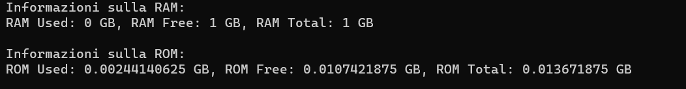
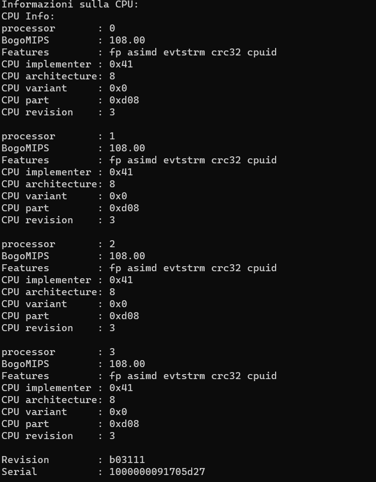

# visualizza i dati della RAM, ROM totale Libera e usata e CPU dI Raspberry

prima parte di configurazione degli using

- Management 


intanto parte di configurazione degli using e namespace


```C#
using System;
namespace lettura_dati_Raspberry;
```

instanzio oggetto della classe Data

```C#
Data data = new Data();
```

Leggi le informazioni sulla RAM, ROM e CPU dal PC locale e stampa in automatico

```C#
class Program
{
    static void Main(string[] args)
    {
        Data data = new Data();

        // Stampare informazioni sulla RAM, ROM e CPU
        Console.WriteLine("Informazioni sulla RAM:");
        Console.WriteLine(data.GetRamInfo());

        Console.WriteLine("\nInformazioni sulla ROM:");
        Console.WriteLine(data.GetRomInfo());

        Console.WriteLine("\nInformazioni sulla CPU:");
        Console.WriteLine(data.GetCpuInfo());
    }
}
```

implementazione Classe Data con gli using e namespace

```C#
using System.Diagnostics;
namespace lettura_dati_Raspberry;
```

crea la classe Data

```C#
class Data
{
    // vari metodi
}
```

dentro la classe Data creo i vari metodi

- ottieni RAM

```C#
public string GetRamInfo()
{
    try
    {
        var processStartInfo = new ProcessStartInfo
        {
            FileName = "free",
            RedirectStandardOutput = true,
            UseShellExecute = false,
            CreateNoWindow = true
        };

        using (var process = Process.Start(processStartInfo))
        {
            using (var reader = process.StandardOutput)
            {
                string output = reader.ReadToEnd();
                string[] lines = output.Split('\n');

                if (lines.Length >= 2)
                {
                    string[] values = lines[1].Split(new[] { ' ' }, StringSplitOptions.RemoveEmptyEntries);

                    if (values.Length >= 4)
                    {
                        ulong totalRam = ulong.Parse(values[1]);
                        ulong usedRam = ulong.Parse(values[2]);
                        ulong freeRam = ulong.Parse(values[3]);

                        return $"RAM Used: {usedRam / (1024 * 1024)} GB, RAM Free: {freeRam / (1024 * 1024)} GB, RAM Total: {totalRam / (1024 * 1024)} GB";
                    }
                }
            }
        }

        return "Failed to retrieve RAM information";
    }
    catch (Exception ex)
    {
        return $"Error: {ex.Message}";
    }
}
```

- Ottieni ROM

```C#
public string GetRomInfo()
{
    try
    {
        var processStartInfo = new ProcessStartInfo
        {
            FileName = "df",
            Arguments = "-h /",
            RedirectStandardOutput = true,
            UseShellExecute = false,
            CreateNoWindow = true
        };

        using (var process = Process.Start(processStartInfo))
        {
            using (var reader = process.StandardOutput)
            {
                string output = reader.ReadToEnd();
                string[] lines = output.Split('\n');

                if (lines.Length >= 2)
                {
                    string[] values = lines[1].Split(new[] { ' ' }, StringSplitOptions.RemoveEmptyEntries);

                    if (values.Length >= 6)
                    {
                        ulong totalRom = ulong.Parse(values[1]);
                        ulong usedRom = ulong.Parse(values[2]);
                        ulong freeRom = ulong.Parse(values[3]);

                        return $"ROM Used: {usedRom / (1024 * 1024 * 1024)} GB, ROM Free: {freeRom / (1024 * 1024 * 1024)} GB, ROM Total: {totalRom / (1024 * 1024 * 1024)} GB";
                    }
                }
            }
        }

        return "Failed to retrieve ROM information";
    }
    catch (Exception ex)
    {
        return $"Error: {ex.Message}";
    }
}
```

- Ottieni Info CPU

```C#
public string GetCpuInfo()
{
    try
    {
        var processStartInfo = new ProcessStartInfo
        {
            FileName = "cat",
            Arguments = "/proc/cpuinfo",
            RedirectStandardOutput = true,
            UseShellExecute = false,
            CreateNoWindow = true
        };

        using (var process = Process.Start(processStartInfo))
        {
            using (var reader = process.StandardOutput)
            {
                string output = reader.ReadToEnd();
                return $"CPU Info:\n{output}";
            }
        }
    }
    catch (Exception ex)
    {
        return $"Error: {ex.Message}";
    }
}
```

## ora lo si bilda sul Raspberry

### mi coonnetto via ssh

```bash
sshnome@inidrizzo_ip

sudo service ssh status #vedi se ssh è attivo
sudo service ssh start #attivi ssh
```

### Scarico dotnet passando via scp e lo scarico

```bash
sudo rm -r nomecartella #elimini cartella
rm nomefile #elimini file 
```
### Comprimi La cartella scaricando WinRar e lo passi via SCP al Raspberry con estensuibe .zip

```bash
scp C:\percorso\del\tuo\file.txt pi@192.168.1.2:/percorso/di/destinazione/ #sposti file
scp -r C:\percorso\del\tuo\file.txt pi@192.168.1.2:/percorso/di/destinazione/ #sposti carte
```

### Decompressione file .zip passato da Windows
```bash
sudo apt-get install unzip #scarico file per estensione .zip
unzip nome_file.zip #decomprime file
unzip nome_file.zip -d percorso/di/destinazione #sposto dove mi serve
```

### Scarico Dotnet
```bash
curl -sSL https://dot.net/v1/dotnet-install.sh | bash /dev/stdin --channel STS #scarico dotnet nel raspberry

echo 'export DOTNET_ROOT=$HOME/.dotnet' >> ~/.bashrc
echo 'export PATH=$PATH:$HOME/.dotnet' >> ~/.bashrc
source ~/.bashrc

dotnet --version

chmod +x nomefile #do opzione di esecuzione al file
dotnet run #esegue il codice dotnet
```

### Infine programma funzionate alla fine


