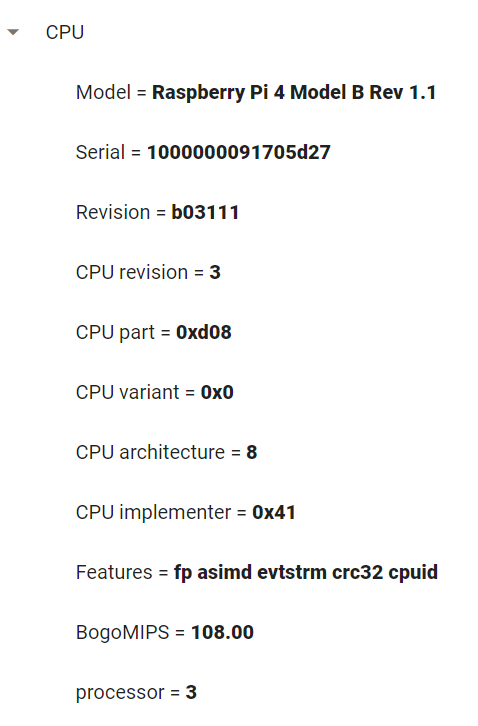
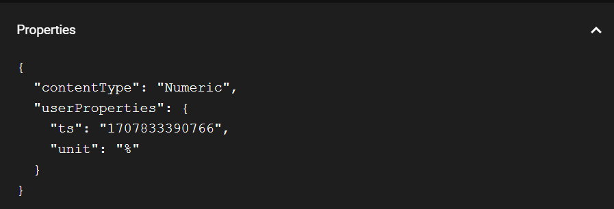

# visualizza i dati della RAM, ROM totale Libera e usata e CPU deI Raspberry

prima parte di configurazione degli using

- Management


intanto parte di configurazione degli using e namespace

```C#
using Lettura_dati_Raspberry;
using System;
using System.Runtime.Intrinsics.Arm;
namespace lettura_dati_Raspberry;
```

Leggi le informazioni sulla RAM, ROM e CPU dal PC locale e stampa in automatico anche l'stanza della clsee Data

```C#

class Program
{
    static void Main(string[] args)
    {
        // instanzio oggetto della classe Data
        Data data = new Data();

        // Stampare informazioni sulla RAM, ROM e CPU
        Console.WriteLine("Informazioni sulla RAM:");
        Console.WriteLine(data.GetRamInfo());

        Console.WriteLine("\nInformazioni sulla ROM:");
        Console.WriteLine(data.GetRomInfo());

        Console.WriteLine("\nInformazioni sulla CPU:");
        Console.WriteLine(data.GetCpuInfo());
    }
}
```

implementazione Classe Data con gli using e namespace

```C#
using System.Diagnostics;
using System.Globalizzazion;
namespace lettura_dati_Raspberry;
```

crea la classe Data

```C#
class Data
{
    // vari metodi
}
```

dentro la classe Data creo i vari metodi

- ottieni RAM

    ```C#
    public string GetRamInfo()
    {
        try
        {
            var processStartInfo = new ProcessStartInfo
            {
                FileName = "free",
                RedirectStandardOutput = true,
                UseShellExecute = false,
                CreateNoWindow = true
            };

            using (var process = Process.Start(processStartInfo))
            {
                using (var reader = process.StandardOutput)
                {
                    string output = reader.ReadToEnd();
                    string[] lines = output.Split('\n');

                    if (lines.Length >= 2)
                    {
                        string[] values = lines[1].Split(new[] { ' ' }, StringSplitOptions.RemoveEmptyEntries);

                        if (values.Length >= 4)
                        {
                            ulong totalRam = ulong.Parse(values[1]);
                            ulong usedRam = ulong.Parse(values[2]);
                            ulong freeRam = ulong.Parse(values[3]);

                            // Converti almeno uno dei valori in double per ottenere risultati decimali
                            double usedRamPercentage = (double)usedRam / totalRam * 100;
                            double freeRamPercentage = (double)freeRam / totalRam * 100;

                            return $"RAM Used: {usedRamPercentage:F2}%, RAM Free: {freeRamPercentage:F2}%, RAM Total: {totalRam} MB";
                        }
                    }
                }
            }

            return "Failed to retrieve RAM information";
        }
        catch (Exception ex)
        {
            return $"Error: {ex.Message}";
        }
    }
    ```

- Ottieni ROM

    ```C#
    public string GetRomInfo()
    {
        try
        {
            var processStartInfo = new ProcessStartInfo
            {
                FileName = "df",
                Arguments = "-h /",
                RedirectStandardOutput = true,
                UseShellExecute = false,
                CreateNoWindow = true
            };

            using (var process = Process.Start(processStartInfo))
            {
                using (var reader = process.StandardOutput)
                {
                    string output = reader.ReadToEnd();
                    string[] lines = output.Split('\n');

                    if (lines.Length >= 2)
                    {
                        string[] values = lines[1].Split(new[] { ' ' }, StringSplitOptions.RemoveEmptyEntries);

                        if (values.Length >= 6)
                        {
                            string totalRomStr = values[1].TrimEnd('G');
                            string usedRomStr = values[2].TrimEnd('G');
                            string freeRomStr = values[3].TrimEnd('G');

                            double totalRom = double.Parse(totalRomStr, CultureInfo.InvariantCulture); // Convert GB to MB
                            double usedRom = double.Parse(usedRomStr, CultureInfo.InvariantCulture); // Convert GB to MB
                            double freeRom = double.Parse(freeRomStr, CultureInfo.InvariantCulture); // Convert GB to MB

                            return $"ROM Used: {(usedRom / totalRom) * 100} %, ROM Free: {(freeRom / totalRom) * 100} %, ROM Total: {totalRom} GB";
                        }
                    }
                }
            }

            return "Failed to retrieve ROM information";
        }
        catch (Exception ex)
        {
            return $"Error: {ex.Message}";
        }
    }
    ```

- Ottieni Info CPU

    ```C#
    public string GetCpuInfo()
    {
        try
        {
            var processStartInfo = new ProcessStartInfo
            {
                FileName = "cat",
                Arguments = "/proc/cpuinfo",
                RedirectStandardOutput = true,
                UseShellExecute = false,
                CreateNoWindow = true
            };

            using (var process = Process.Start(processStartInfo))
            {
                using (var reader = process.StandardOutput)
                {
                    string output = reader.ReadToEnd();
                    return $"CPU Info:\n{output}";
                }
            }
        }
        catch (Exception ex)
        {
            return $"Error: {ex.Message}";
        }
    }
    ```

## ora lo si bilda sul Raspberry

### mi connetto via ssh

```bash
sshnome@inidrizzo_ip

sudo service ssh status #vedi se ssh è attivo
sudo service ssh start #attivi ssh
```

### Scarico dotnet passando via scp e lo scarico

```bash
sudo rm -r nomecartella #elimini cartella
rm nomefile #elimini file
```

### Comprimi La cartella scaricando WinRar e lo passi via SCP al Raspberry con estensuibe .zip

```bash
scp C:\percorso\del\tuo\file.txt pi@192.168.1.2:/percorso/di/destinazione/ #sposti file
scp -r C:\percorso\del\tuo\file.txt pi@192.168.1.2:/percorso/di/destinazione/ #sposti carte
```

### Decompressione file .zip passato da Windows

```bash
sudo apt-get install unzip #scarico file per estensione .zip
unzip nome_file.zip #decomprime file
unzip nome_file.zip -d percorso/di/destinazione #sposto dove mi serve
```

### Scarico Dotnet

```bash
curl -sSL https://dot.net/v1/dotnet-install.sh | bash /dev/stdin --channel STS #scarico dotnet nel raspberry

echo 'export DOTNET_ROOT=$HOME/.dotnet' >> ~/.bashrc
echo 'export PATH=$PATH:$HOME/.dotnet' >> ~/.bashrc
source ~/.bashrc

dotnet --version

chmod +x nomefile #do opzione di esecuzione al file
dotnet run #esegue il codice dotnet
```

### Infine programma funzionante alla fine


# Dati con il Protocollo MQTT

## Implementami la funzionalità per usare MQTT nel Raspberry

aggiungi pacchetti per l'uso del Protocollo MQTTnet

```bash
dotnet add package MQTTnet
```

Nel progetto di Visual studio scarichi MQTTnet per poterci lavorare


Nel file csproj aggiungi questa configurazione

```bash
nano Lettura_dati_Raspberry.csproj #modifici file e aggiungi la riga che segue
```

```xml
 <ItemGroup>
    <PackageReference Include="MQTTnet" Version="3.0.0" /><!-- qui includo il pacchetto MQTTnet con la versione 3.0.0 -->
</ItemGroup>
```

Infine il seguente comando per bildare il progetto

```bash
dotnet build #bilda il progetto
```

Creo una classe dove fare le implementazioni di cosa mandare via MQTT

```C#
internal class DataSend{
    // vari metodi
}
```

Implementazione degli using e Namespace della classe DataSend

```C#
using System;
using System.Text;
using System.Threading.Tasks;
using MQTTnet;
using MQTTnet.Client;
using MQTTnet.Formatter;
using MQTTnet.Protocol;
using MQTTnet.Server;
namespace Lettura_dati_Raspberry;
```

Aggiungere le variabili della classe dove mettere le credenzili

```C#
private static IMqttClient _mqttClient;
private static string _brokerAddress = "indirizzo server";
private static int _brokerPort = 1883;
private static string _username = "nome utente";
private static string _password = "password";
private static MqttProtocolVersion _protocolVersion = MqttProtocolVersion.V500;
```

### Creo le funzioni che mi servono

- Per inizializzare il client (\_initclient)

    ```C#
    private static void _initclient()
    {
        if (_mqttClient == null)
        {
            var factory = new MqttFactory();
            _mqttClient = factory.CreateMqttClient();
        }
    }
    ```

- Per connetersi al Client (\_connectclient)

    ```C#
    private static async Task _connectclient()
    {
        _initclient();

        if (!_mqttClient.IsConnected)
        {
            var options = new MqttClientOptionsBuilder()
                .WithTcpServer(_brokerAddress, _brokerPort)
                .WithCredentials(_username, _password)
                .WithClientId(_clientId)
                .WithProtocolVersion(_protocolVersion)
                .Build();

            await _mqttClient.ConnectAsync(options);
        }
    }
    ```

- per inviare i dati nel topic che mi interssa con il messaggio interessato (Send)

    ```C#
    public static async Task Send(string topic, string message)
    {
        await _connectclient();


        var mqttMessage = new MqttApplicationMessageBuilder()
            .WithTopic(topic)
            .WithPayload(message)
            .WithQualityOfServiceLevel(MqttQualityOfServiceLevel.AtLeastOnce)  // Choose the appropriate QoS level
            .Build();

        await _mqttClient.PublishAsync(mqttMessage);
    }
    ```

Visualizzo l'invio dei dati nei topic cambaindo coosi il programma 

```C#
static async Task Main(string[] args)
{
    Data data = new Data();

    // Stampare informazioni sulla RAM, ROM e CPU
    Console.WriteLine("Informazioni sulla RAM:");
    string RAM = data.GetRamInfo();
    await DataSend.Send("RAM", RAM);
    Console.WriteLine(RAM);

    Console.WriteLine("\nInformazioni sulla ROM:");
    string ROM = data.GetRomInfo();
    await DataSend.Send("ROM", ROM);
    Console.WriteLine(ROM);

    Console.WriteLine("\nInformazioni sulla CPU:");
    string CPU = data.GetCpuInfo();
    await DataSend.Send("CPU", CPU);
    Console.WriteLine(CPU);
}
```

creo una classe SensorData dove ottengo i vari tipi di dati da mandare via MQTT
```C#
internal class SensorData{
    // codice 
}
```

creo i vari attributi della classe SensorData
```C#
public string Name { get; set; } = "";
public string Value { get; set; } = "";
public string Unit { get; set; } = "";
```

modifico i vari metodi della classe Data con le impostazioni che mando i dati via MQTT

- funzione GetRamInfo 
    ```C#
    public List<SensorData> GetRamInfo()
    {
        List<SensorData> sensorData = new List<SensorData>();

        try
        {
            var processStartInfo = new ProcessStartInfo
            {
                FileName = "free",
                RedirectStandardOutput = true,
                UseShellExecute = false,
                CreateNoWindow = true
            };

            using (var process = Process.Start(processStartInfo))
            {
                using (var reader = process.StandardOutput)
                {
                    string output = reader.ReadToEnd();
                    string[] lines = output.Split('\n');

                    if (lines.Length >= 2)
                    {
                        string[] values = lines[1].Split(new[] { ' ' }, StringSplitOptions.RemoveEmptyEntries);

                        if (values.Length >= 4)
                        {
                            ulong totalRam = ulong.Parse(values[1]);
                            ulong usedRam = ulong.Parse(values[2]);
                            ulong freeRam = ulong.Parse(values[3]);

                            // Converti almeno uno dei valori in double per ottenere risultati decimali
                            double usedRamPercentage = (double)usedRam / totalRam * 100;
                            double freeRamPercentage = (double)freeRam / totalRam * 100;

                            sensorData.Add(
                                new SensorData // istaznzio già i dati popolandoli con i dati interessati
                                {
                                    Name = "RAM/Free",
                                    Value = freeRamPercentage.ToString(CultureInfo.InvariantCulture),
                                    Unit = "%"
                                }
                            );

                            sensorData.Add(
                                new SensorData
                                {
                                    Name = "RAM/Used",
                                    Value = usedRamPercentage.ToString(CultureInfo.InvariantCulture),
                                    Unit = "%"
                                });

                            sensorData.Add(
                                new SensorData
                                {
                                    Name = "RAM/Total",
                                    Value = totalRam.ToString(CultureInfo.InvariantCulture),
                                    Unit = "MB"
                                }
                                );
                        }
                    }
                }
            }
        }
        catch (Exception ex)
        {
            Console.WriteLine($"Error: {ex.Message}");
        }

        return sensorData;
    }
    ```

- Funzione GetRomInfo
    ```C#
    public List<SensorData> GetCpuInfo()
    {
        List<SensorData> sensorData = new List<SensorData>();

        try
        {
            var processStartInfo = new ProcessStartInfo
            {
                FileName = "cat",
                Arguments = "/proc/cpuinfo",
                RedirectStandardOutput = true,
                UseShellExecute = false,
                CreateNoWindow = true
            };

            using (var process = Process.Start(processStartInfo))
            {
                using (var reader = process.StandardOutput)
                {

                    while (!reader.EndOfStream)
                    {
                        string line = reader.ReadLine();

                        // Split the line into key and value
                        string[] parts = line.Split(new char[] { ':' }, 2, StringSplitOptions.RemoveEmptyEntries);
                        if (parts.Length == 2)
                        {
                            string key = parts[0].Trim();
                            string value = parts[1].Trim();


                            sensorData.Add(new SensorData
                            {
                                Name = $"CPU/{key}",
                                Value = value,
                                Unit = ""
                            });
                        }
                    }
                }
            }
        }
        catch (Exception ex)
        {
            Console.WriteLine($"Error: {ex.Message}");
        }

        return sensorData;
    }
    ```

infine mettere dati perchè arrivino ogni minuto i nuovi dati
```C#
class Program
{
    static async Task Main(string[] args)
    {
        Data data = new Data();
        
        var timer = new Timer(async _ => // va vedere il tempo di timer
        {
            await DateperMinute(data);
        }, null, TimeSpan.Zero, TimeSpan.FromMinutes(1)); // manda una voolta al minuto

        Console.WriteLine("Press Enter to exit.");
        Console.ReadLine();
    }

    static async Task DateperMinute(Data data)
    {
        // invia i dati via MQTT

        foreach (var ramData in data.GetRamInfo())
            await DataSend.Send(ramData.Name, ramData.Value);

        foreach (var romData in data.GetRomInfo())
            await DataSend.Send(romData.Name, romData.Value);

        foreach (var cpuData in data.GetCpuInfo())
            await DataSend.Send(cpuData.Name, cpuData.Value);

        Console.WriteLine("Data sent to MQTT."); // manda messaggio che ti dice se è arrivato il messaggi 
    }
}
```

infine per avviare il progetto

```bash
dotnet run #avvia il progetto
```

### Visualizzazione dati di invio su Console


per uscire premi invio altrimenti ogni minuto ti manda i messaggi e ti scrive Data Send to MQTT

### Dati Arrivati al Client MQTT

- RAM

    

- ROM

    

- CPU

    

## mplementazione funzione GetMacAdress per ottenere il Mac Address del Raspberry
```C#
public List<SensorData> GetMacAddress()
{
    List<SensorData> sensorData = new List<SensorData>();
    string macAddress = string.Empty;

    try
    {
        NetworkInterface[] networkInterfaces = NetworkInterface.GetAllNetworkInterfaces();

        foreach (NetworkInterface networkInterface in networkInterfaces)
        {
            if (networkInterface.NetworkInterfaceType == NetworkInterfaceType.Ethernet ||
                networkInterface.NetworkInterfaceType == NetworkInterfaceType.Wireless80211)
            {
                macAddress = networkInterface.GetPhysicalAddress().ToString();

                sensorData.Add(new SensorData
                {
                    Name ="MAC ADDRESS",
                    Value = macAddress,
                    Unit = ""
                });
            }
        }
    }
    catch (Exception ex)
    {
        Console.WriteLine($"Error: {ex.Message}");
    }

    return sensorData;
}
```


### Migloramento Program.cs vedendo il risultato nel topic come nome del Mac Adress del Dipositivo e poi il dato
```C#
using Lettura_dati_Raspberry;
using System;
using System.Runtime.Intrinsics.Arm;
using static System.Runtime.InteropServices.JavaScript.JSType;
namespace lettura_dati_Raspberry;
class Program
{
    static async Task Main(string[] args)
    {
        Data data = new Data();
        List<SensorData> macs = data.GetMacAddress();

        if (macs.Count == 0) throw new Exception("No MacAddress found");

        Task dataTask = Task.Run(() => DateperMinute(data, macs[0].Value)); // richamo la funzione 

        while (true)
            Thread.Sleep(60000); // manda i messaggi al mqtt anche se il programma non è avviato ma la macchina deve essere accesa

    }

    static async Task DateperMinute(Data data, string mac)
    {
        // invia i dati via MQTT
        while (true)
        {
            foreach (SensorData sensorData in data.GetRamInfo().Concat(data.GetRomInfo()).Concat(data.GetCpuInfo()))
                await DataSend.Send($"{mac}/{sensorData.Name}", sensorData.Value);

            Thread.Sleep(60000); // esegue ogni minuto
        }
    }
}
```


## visualizzazione dati con Mac Address


User And Stakeholders -> chiunque ha l'utilità di monitorare i dati

### modifica topic con parte anche measures

```C#
static async Task DateperMinute(Data data, string mac)
{
    // invia i dati via MQTT
    while (true)
    {
        foreach (SensorData sensorData in data.GetRamInfo().Concat(data.GetRomInfo()).Concat(data.GetCpuInfo()))
            await DataSend.Send($"measures/@{mac}/{sensorData.Name}", sensorData.Value);

        Thread.Sleep(60000); // esegue ogni minuto
    }
}
```

## visualizzazione dati con topic Measures


# Manda dati con Propreties corrette

1)  modifico metodo Send nella classe DataSend

    ```C#
    public static async Task Send(string topic,SensorData Sensordata, string ts)
    {
        await _connectclient();


        var mqttMessage = new MqttApplicationMessageBuilder()
            .WithTopic(topic)
            .WithPayload(Sensordata.Value)
            .WithContentType(Sensordata.ContentType)
            .WithUserProperty("ts", ts) // ottengo tempo di ricezione del messaggio
            .WithUserProperty("unit", Sensordata.Unit)
            .WithQualityOfServiceLevel(MqttQualityOfServiceLevel.AtLeastOnce)  // Choose the appropriate QoS level
            .Build();

        await _mqttClient.PublishAsync(mqttMessage);
    }
    ```

2) dicharo una variabile sia lettura che scrittura (get set) nella classe SensorData

    ```C#
    public string ContentType { get; set; } = "";
    ```

3) infine modifico le varie classi con le impostazioni del tipo ContentType se numeric oppure Text nella classe Data

    - Metodo RAM

        ```C#
        sensorData.Add(
            new SensorData // istaznzio già i dati popolandoli con i dati interessati
            {
                Name = "ROM/Free",
                Value = usedrompercentual.ToString(CultureInfo.InvariantCulture),
                Unit = "%",
                ContentType = "Numeric"
            }
        );

        sensorData.Add(
            new SensorData
            {
                Name = "ROM/Used",
                Value = freerompercentual.ToString(CultureInfo.InvariantCulture),
                Unit = "%",
                ContentType = "Numeric"
            });

        sensorData.Add(
            new SensorData
            {
                Name = "ROM/Total",
                Value = totalRom.ToString(CultureInfo.InvariantCulture),
                Unit = "GB",
                ContentType = "Numeric"
            }
            );
        ```

    - Metodo ROM

        ```C#
        sensorData.Add(new SensorData
        {
            Name = $"CPU/{key}",
            Value = value,
            Unit = "",
            ContentType = "Text"
        });
        ```
    
    - Metodo CPU

        ```C#
        sensorData.Add(new SensorData
        {
            Name = $"CPU/{key}",
            Value = value,
            Unit = "",
            ContentType = "Text"
        });
        ```

4) cambio metodo DatePerMinute in program
```C#
static async Task DateperMinute(Data data, string mac)
{
    // invia i dati via MQTT
    while (true)
    {
        string ts = DateTimeOffset.UtcNow.ToUnixTimeMilliseconds().ToString();

        foreach (SensorData sensorData in data.GetRamInfo().Concat(data.GetRomInfo()).Concat(data.GetCpuInfo()))
            await DataSend.Send($"measures/@{mac}/{sensorData.Name}", sensorData, ts);

        Thread.Sleep(60000); // esegue ogni minuto
    }
}
```

5) Visualizzazione Propreties


